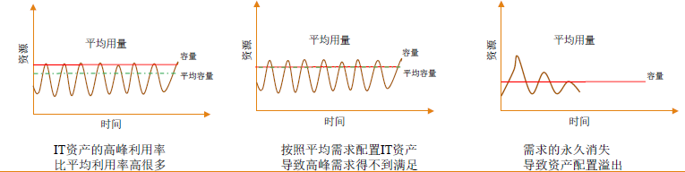

# 第一章 云计算概论

## 第一节 什么是云计算

### 云是网络、互联网的一种比喻说法

### 云计算（cloud computing）是基于互联网的相关服务的增加、使用和交付模式，通常涉及通过互联网来提供动态易扩展且经常是虚拟化的资源

### 美国国家标准与技术研究院（NIST）的定义：

​	云计算是一直**按使用量付费**的模式，这种模式提供可用的、便捷的、按需的网络访问，进入**可配置的计算资源共享池**（资源：网络、服务器、存储、应用软件、服务），这些资源能够被快速提供，只需投入**很少的管理工作**，或与服务供应商进行很少的交互

## 第二节 云计算的产生背景

### 云计算是继1980年代大型计算机到客户端-服务器的大转变之后的又一种巨变

### 云计算是分布式计算（Distributed Computing）、并行计算（Parallel Computing）、效用计算（Utility Computing）、网络存储（Network Storage Technologies）、虚拟化（Virtualization）、负载均衡（Load Balance）、热备份冗余（High Available）等传统计算机和网络技术发展融合的产物

## 第三节 云计算的发展历史

| 年份 | 云计算的发展                                                 |
| :--: | ------------------------------------------------------------ |
| 1983 | 网络是电脑                                                   |
| 2006 | Amazon：弹性计算云服务（EC2） Google：云计算概念        |
| 2007 | Google与IBM：高校推广，提供技术支持                          |
| 2008 | IBM：第一个云计算中心 戴尔：申请云计算商标              |
| 2010 | Novell与CSA：可信任云计算计划                                |
| 2013 | 中国IaaS：市场规模约为10.5亿元 中国PaaS：市场规模增长近20% 全球SaaS：云计算领域最为成熟的细分市场 |
| 2015 | 云计算方面的相关政策不断更新                                 |

## 第四节 云计算的本质

云计算的规模效应

- 案例：需要大量存储容量，设计一个存储解决方案
- ​	构建独享的存储框架、购买网络存储设备、使用AWS
- 低利用率场景无法避免，因为高峰利用率可能达到80%甚至更高
- ​	非高峰阶段出现大量资源浪费

## 第五节 本章小结

云计算作为一种新型的计算模式，利用高速互联网的传输能力将数据的处理过程从个人计算机或服务器转移到互联网上的计算机集群中，带给用户前所未有的计算能力

云计算的产生与发展，使用户直接面对的将不再是复杂的硬件和软件，而是最终的服务

云计算将计算任务发布在大量计算机构成的资源池上，使各种应用系统能够根据需要获取计算力、存储空间和各种软件服务

云计算现在

